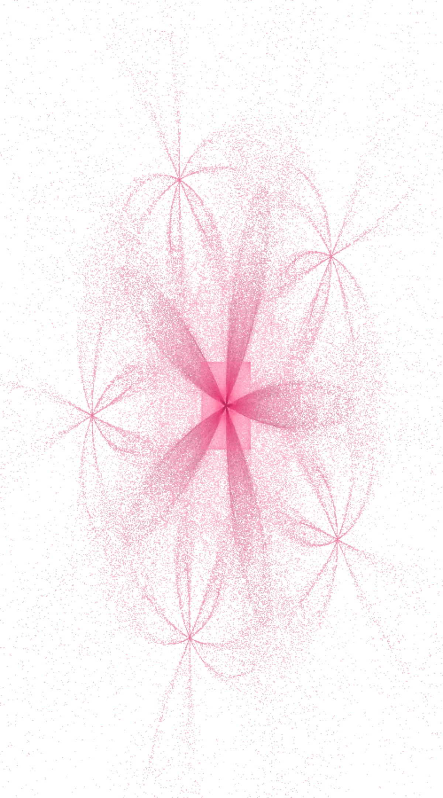

# Shirt Designing Using Fractals

## Project Description

**Shirt Designing Using Fractals** is a Python generative design
project that uses fractal mathematics to create an organic, flower-like
pattern that can be used as inspiration for shirt and textile designs.

The project generates a **flame fractal** using an **Iterated Function
System (IFS)** and the **chaos-game algorithm**. Nonlinear
transformations such as petal, sinusoidal, spherical, and swirl
variations are combined with **5-fold rotational symmetry** to produce a
layered floral pattern. Density-based rendering, color blending, and a
pink/white color palette give the final design a soft printed-fabric
appearance.

The generated pattern can be adapted as a repeating textile motif,
front-shirt graphic, or decorative fashion print.

## Fractal Type Implemented

### Flame Fractal

The main fractal implemented is a **Flame Fractal**, a type of
generative fractal based on Iterated Function Systems with nonlinear
variations.

The implementation specifically uses:

-   **Iterated Function System (IFS)**
-   **Chaos-game iteration**
-   **5-fold rotational symmetry**
-   **Petal/flower-style symmetry**
-   **Nonlinear variations**
    -   Linear
    -   Sinusoidal
    -   Spherical
    -   Swirl
    -   Petal
-   **Log-density tone mapping**
-   **Per-pixel color averaging and blending**

The **petal variation** and 5-fold symmetry are responsible for the main
flower-like structure visible in the output.

## Tools, Language & Libraries

### Language

-   **Python**

### Libraries

-   **NumPy** --- numerical calculations, arrays, random transform
    selection, and histogram generation
-   **Matplotlib** --- rendering and saving the final fractal image
-   **Matplotlib LinearSegmentedColormap** --- creation of the custom
    pink color palette

### Other Tools

-   Python-compatible IDE/editor such as **VS Code**
-   PNG image output

## How It Works

The fractal is generated in several stages:

1.  **Nonlinear variations**\
    The program defines several mathematical transformations that warp
    points into curved and organic shapes.

2.  **Base transformations**\
    Affine transformations are defined using coefficients
    `a, b, c, d, e, f`, together with weights, variations, and color
    values.

3.  **5-fold symmetry**\
    Each base transformation is duplicated and rotated by multiples of:

    `2π / 5`

    This creates the five-direction flower symmetry of the final design.

4.  **Chaos-game iteration**\
    A random weighted transformation is repeatedly selected and applied
    to a point. After a short burn-in period, hundreds of thousands of
    points are collected.

5.  **Density rendering**\
    The generated points are converted into a 2D histogram. Areas
    containing more points become more visually prominent.

6.  **Log-density mapping**\
    Logarithmic tone mapping allows both the bright central region and
    the lighter outer details to remain visible.

7.  **Color blending**\
    The points are mapped to a custom pink color gradient and blended
    with a white background.

8.  **Final image**\
    The result is saved as `flame_fractal.png`.

## Output

The generated design has a **five-petal floral appearance** with
layered, glowing structures extending from the center. Its symmetry and
organic curves make it suitable as a conceptual textile or shirt-print
pattern.



> **Note:** Place the generated `flame_fractal.png` file in the same
> directory as this `README.md` for the image to appear on GitHub.

## Setup

Make sure Python is installed on your system.

Install the required libraries using:

``` bash
pip install numpy matplotlib
```

## Running the Project

1.  Save the Python code as a file, for example:

``` text
flame_fractal.py
```

2.  Open a terminal in the project directory.

3.  Run:

``` bash
python flame_fractal.py
```

4.  The program will generate:

``` text
flame_fractal.png
```

The image is created automatically using the settings in the `main`
section of the program.

## Main Configuration

The current implementation uses:

  Setting                          Value
  ----------------------- --------------
  Fractal points                 600,000
  Burn-in / skip points               20
  Symmetry                        5-fold
  Image width                        500
  Image height                       900
  Random seed                          7
  Output format                      PNG
  Background                       White
  Main palette              Pink / white


## Project Structure

``` text
Shirt-Designing-Using-Fractals/
│
├── flame_fractal.py
├── flame_fractal.png
└── README.md
```

## Student Information

**Student Name:** Manahel Zulqarnain\
**Registration Number:** `540650`

## Conclusion

This project demonstrates how mathematical fractals can be used for
creative design. By combining IFS transformations, nonlinear variations,
rotational symmetry, and color mapping, a complex floral pattern is
generated entirely through code.

The approach can be extended to create different shirt designs by
changing the fractal variations, symmetry, transformation weights,
colors, point density, and image dimensions.
